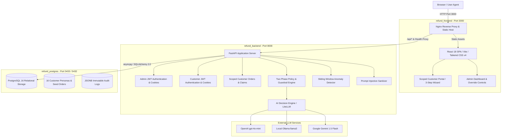

# AI Customer Support Refund System

An automated, intelligent e-commerce customer support refund decision engine built with **FastAPI**, **React 18 / Vite / TypeScript**, **PostgreSQL 16**, and **LiteLLM**.

The platform evaluates incoming customer refund claims against machine readable policy documents, customer transaction histories, and real time fraud risk metrics, producing defensible decisions: **Approved**, **Denied**, or **Escalated**.

---

## Architecture Overview



### Core Technology Stack

- **Backend Framework**: Python 3.11, FastAPI, Pydantic v2, structlog.
- **Relational Persistence**: SQLAlchemy 2.0 (asyncio + asyncpg driver), Alembic migrations, PostgreSQL 16.
- **Frontend Application**: React 18, TypeScript, Vite, Tailwind CSS v4, TanStack Query, React Router v6, Axios, Lucide Icons.
- **AI Integration**: LiteLLM unified gateway with dynamic runtime model switching and automatic failure escalation.
- **Reverse Proxy & Delivery**: Nginx Alpine with dual stack IPv4 and IPv6 loopback routing.
- **Orchestration**: Docker Compose with dependency chaining and automated container healthchecks.

---

## Key System Capabilities

### 1. Two Phase Decision Pipeline with Deterministic Guardrails
- **Phase 1 (Deterministic Check)**: Before invoking external AI models, the engine verifies hard business policies (e.g. final sale items, expired return window, orders not delivered). Immediate denials or escalations occur with zero AI token consumption.
- **Phase 2 (AI Evaluation)**: Eligible claims are evaluated by the AI engine, analyzing customer return reasoning, product condition, and purchase context against store guidelines.
- **Post Evaluation Safety Guardrails**: AI decisions pass through a deterministic validation interceptor. If an AI model hallucinates or attempts to approve a prohibited item due to prompt injection, the guardrail immediately overrides the decision to `denied` and logs a security incident.

### 2. Customer Authentication and Scoped Refund Portal
- **Isolated Authentication**: Dedicated customer authentication service issuing scoped JWT tokens stored in HTTP-only `customer_access_token` and `customer_refresh_token` cookies, completely decoupled from administrative credentials.
- **Session Derived Identity**: Zero client side identity spoofing. Customers never enter manual emails or select sample personas; all claims derive customer identity strictly from the verified session context.
- **Server Side Order Ownership**: Every claim submission validates that the target `order_id` belongs to `current_customer.id`, rejecting unauthorized access with HTTP 403 Forbidden.
- **Duplicate Claim Prevention**: Prevents duplicate claims on already approved or pending line items with HTTP 400 Bad Request and frontend selection badges.
- **3 Step Return Wizard**: Intuitive customer experience guiding users through Order & Item Selection, Reason & Notes, and Review & Confirmation with real time validation.

### 3. Multi Provider LLM Integration
- Supports **OpenAI** (`gpt-4o-mini`), **Local Ollama** (`llama3`), and **Google Gemini** (`gemini-1.5-flash`).
- Administrators can switch active providers and test endpoint connectivity live in the Admin Settings UI without redeploying containers.
- Failures, timeouts, or network disconnections gracefully degrade to human supervisor escalation with structured audit telemetry.

### 4. Security Hardening and Fraud Prevention
- **Prompt Injection Defense**: Multi pattern regex sanitizer intercepts delimiter manipulation, role hijacking, instruction overrides, and script tags, neutralizing adversarial inputs before processing.
- **Velocity Limit Anomalies**: Flags customers submitting 3 or more refund requests within a rolling 24 hour window.
- **High Value Clusters**: Flags claims exceeding $200.00 individually or $500.00 cumulatively over 7 days.
- **Conflicting Claim Detection**: Identifies duplicate claims filed against the same order line item within 30 days.

### 5. Administrative Control and Operational Oversight
- Role based authentication using HTTP-only cookies with cryptographic JWT refresh token rotation.
- Real time dashboard displaying refund metrics, risk scores, anomaly badges, and policy summaries.
- Slide over inspection drawer providing customer purchase history, AI confidence ratings, policy rule checks, and supervisor decision override tools.

---

## Quickstart with Docker Compose

The complete full stack application boots from scratch with a single command. Database schemas, Alembic migrations, and 16 customer test personas are automatically provisioned.

### 1. Clone the Repository
```bash
git clone https://github.com/abbeymaniak/ai-customer-support-refund.git
cd ai-customer-support-refund
```

### 2. Launch Containers
```bash
# Run detached in the background
docker compose up -d

# Or run in the foreground with live logs and forced image rebuild
docker compose up --build
```

### 3. Access Live Application Surfaces
- **Public Storefront & Landing**: [http://localhost:3000](http://localhost:3000)
- **Customer Authentication**: [http://localhost:3000/login](http://localhost:3000/login)
- **Scoped Customer Refund Portal**: [http://localhost:3000/portal](http://localhost:3000/portal)
- **Administrative Login**: [http://localhost:3000/admin/login](http://localhost:3000/admin/login)
- **Administrative Dashboard**: [http://localhost:3000/admin](http://localhost:3000/admin)
- **Interactive OpenAPI Swagger Docs**: [http://localhost:8000/docs](http://localhost:8000/docs)
- **FastAPI Health Endpoint**: [http://localhost:8000/health](http://localhost:8000/health)
- **PostgreSQL Database**: Host port `5433` (internal `5432`) (`refunds_user` / `refunds_pass`)

### 4. Stop and Reset Options
- **Stop containers and preserve data**:
  ```bash
  docker compose down
  ```
  Halts and removes the running containers while keeping all submitted refund claims, admin settings, and database records safely stored in the `postgres_data` volume.

- **Full factory reset (wipe database and reseed)**:
  ```bash
  docker compose down -v
  ```
  Stops containers and removes the persistent `postgres_data` volume. The next `docker compose up -d` boots a clean PostgreSQL instance and automatically runs `data/seed.sql` to restore fresh initial personas and test orders.

---

## Default Test Personas and Credentials

### Customer Evaluator Accounts
Log in at [http://localhost:3000/login](http://localhost:3000/login) using any seeded customer persona (all seeded customers share the default password `customer123`). Quick login buttons are also provided on the customer login page for evaluator convenience:

| Customer Persona | Email | Password | Orders | Risk Score | Expected Test Scenario |
|---|---|---|---|---|---|
| Sarah Jenkins (Loyal VIP) | `sarah.jenkins@example.com` | `customer123` | 18 | 0.05 | Immediate auto approval for standard returns |
| Marcus Vance (Serial Returner) | `marcus.vance@example.com` | `customer123` | 5 | 0.85 | Velocity and return rate anomaly escalation |
| Victoria Sterling (High Spender) | `victoria.sterling@example.com` | `customer123` | 32 | 0.10 | Low risk processing across premium purchases |
| Amanda Price (Final Sale) | `amanda.price@example.com` | `customer123` | 2 | 0.70 | Deterministic policy denial on clearance item |
| James Wilson (High Value) | `james.wilson@example.com` | `customer123` | 4 | 0.65 | Escalation for claim amount exceeding $500 threshold |
| Kevin Chen (Expired Window) | `kevin.chen@example.com` | `customer123` | 3 | 0.75 | Deterministic policy denial for delivery > 90 days ago |

### Administrative Evaluator Accounts
Log in at [http://localhost:3000/admin/login](http://localhost:3000/admin/login) using either account:

| Account | Email | Password | Role |
|---|---|---|---|
| Store Administrator | `admin@store.com` | `admin123` | admin |
| System Administrator | `admin@refunds.internal` | `AdminPassword123!` | admin |
| Support Lead | `lead@store.com` | `lead123` | agent |

---

## Policy Engine Configuration (`data/refund_policy.json`)

The store policy defines explicit boundaries:
- **Return Time Window**: Standard 30 days from delivery; extended 90 days for damaged or defective goods.
- **Auto Approval Limit**: Claims up to $100.00 qualify for automated approval when policy conditions are met.
- **Human Escalation Threshold**: Single item requests above $500.00 require supervisor intervention.
- **Risk Score Rules**: Customers with return rates >= 40% or >= 3 prior refunds escalate automatically.
- **Prohibited Categories**: Clearance items marked final sale, perishable goods, and digital downloads cannot be refunded.

---

## Local Development (Without Docker)

### Backend Service Setup
```bash
cd backend
python3 -m venv .venv
source .venv/bin/activate
pip install -r requirements.txt
uvicorn app.main:app --reload --port 8000
```

### Frontend Application Setup
```bash
cd frontend
npm install
npm run dev
```
Development frontend runs at [http://localhost:5173](http://localhost:5173).

---

## Automated Testing Suite

The repository maintains full automated test coverage across backend business logic and frontend user interfaces (235 total tests).

### Backend Pytest Suite (129 tests)
Run tests inside the live backend container:
```bash
docker compose exec backend pytest
```
Or execute locally on your host environment:
```bash
cd backend
source .venv/bin/activate
pytest
```

### Frontend Vitest Suite (106 tests across 16 test files)
Run unit and component tests:
```bash
cd frontend
npm test -- --run
```
Validate TypeScript types and build bundle:
```bash
cd frontend
npm run build
```

---

## Review and Evaluation Deliverables

Comprehensive technical walkthrough documents are provided for evaluators:

1. **Interactive HTML Review (`review.html`)**:
   - Self contained, responsive presentation document with dark and light theme toggle.
   - Built in pure SVG interactive database relationship diagram supporting pan, zoom, and table detail inspection across all 10 relational entities without external CDN dependencies.
   - High resolution screenshots covering customer workflows, administrative dashboards, and LLM settings.
   - Open directly in any modern browser: `open review.html`

2. **Executive Word Document (`review.docx`)**:
   - Formatted Microsoft Word deliverable generated using `scripts/generate_review_docx.py`.
   - Includes full narrative chapters, structured schema tables, and embedded high resolution UI screenshots.
   - Regenerate at any time:
     ```bash
     python scripts/generate_review_docx.py
     ```

*(Note: Generated `review.html` and `review.docx` files are excluded from git tracking via `.gitignore` to maintain repository cleanliness).*

---

## Git Workflow and Branching Strategy

The repository follows an incremental tracer bullet development approach with dedicated feature branches merged to `main` upon verification:

- `feat/stack-architecture`: Initial FastAPI, React, PostgreSQL scaffolding.
- `feat/data-policy-layer`: PostgreSQL schema, refund policy JSON, Alembic migrations.
- `feat/core-refund-loop`: End to end customer refund wizard and decision persistence.
- `feat/ai-decision-engine`: LiteLLM integration, system prompts, structured outputs.
- `feat/admin-dashboard`: Support agent dashboard, search filters, detail drawer, manual overrides.
- `feat/admin-authentication`: JWT cookie security, bcrypt hashing, session token rotation.
- `feat/input-validation-prompt-injection`: Input sanitization, boundary defense, security telemetry.
- `feat/security-edge-case-hardening`: Anomaly scoring, velocity limits, deterministic guardrails.
- `feat/database-seeding-docker-orchestration`: Healthcheck chaining, automated migrations, 16 seed personas.
- `feat/documentation-explanation-files`: Technical documentation, interactive schema diagram, Word generator.
- `feat/customer-authentication`: Customer model credentials, password hashing, JWT issuance, `/api/customer/auth/*` endpoints, and frontend customer login.
- `feat/scoped-customer-refund-portal`: Scoped customer orders endpoint, claim submission with server-side order ownership verification, duplicate claim prevention, and authenticated 3-step wizard.
